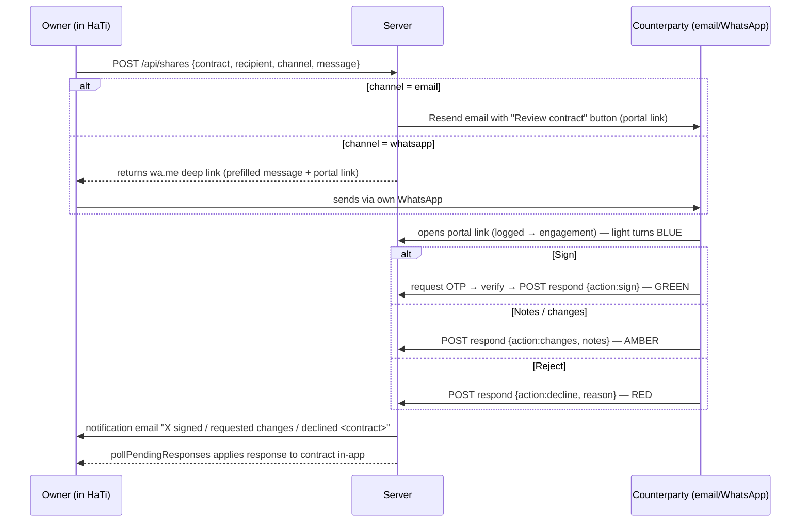

# Design: Contract Sharing via Email & WhatsApp with Traffic-Light Response Tracking

Status: **Phases 1 & 2 implemented** · Branch: `claude/contract-sharing-email-whatsapp-je5b10`

Decisions taken (§11 open questions): multiple concurrent shares per contract are
supported (one tracked link per recipient; first signature wins, per §11.1);
link expiry defaults to 14 days (owner-adjustable 7/14/30/60 at share time);
first-open notifications are opt-in per user (Team & Settings → My notifications).

## 1. Goal

Let a contract owner send a contract to an external counterparty over **email or WhatsApp**. The counterparty opens it without an account, reviews it, and either **signs**, **sends it back with notes/changes**, or **rejects** it. The outcome flows back into HaTi automatically **and** lands in the owner's email inbox, and every share's state is **traffic-lighted** across the platform (register, workspace, dashboard).

## 2. What already exists (build on it, don't rebuild it)

HaTi already has ~70% of this flow. The design below reuses it:

| Capability | Where it lives today |
|---|---|
| Share link creation (`POST /api/shares`, 12-byte random token) | `server/server.js:1302`, `js/core.js:685` (`openShareModal`) |
| Public counterparty portal (no login) | `js/views/portal.js` (`renderSharePortal`), routed via `#share=` in `js/app.js:405` |
| Counterparty actions: **Approve & sign / Propose edits / Request changes / Decline** | `portal.js:99-182` (`portalRespond`) |
| Sign identity verification: **email OTP** | `POST /api/shares/:token/otp` + `/verify-otp`, `server.js:1336-1357` |
| Response ingestion back into the contract (signature, negotiation round, Declined status) | `js/core.js:725-779` (`applyResponse`), auto-poll `pollPendingResponses` |
| Open/engagement tracking | `engagement` table, `server.js:1319` |
| Email infrastructure (Resend, with dev `outbox` fallback) | `sendEmail()`, `server.js:354-370` |
| Status chips / color system | `STATUS_META` + `statusChip()`, `js/core.js:96-105` |
| Rate limiting on share/OTP endpoints | `rlShare`, `rlOtp`, `server.js:262` |

**The gaps this design fills:**

1. **Delivery** — today the owner manually copies a link. No email send, no WhatsApp send.
2. **Recipient identity on the share** — shares aren't bound to a recipient, have no expiry, and can't be revoked.
3. **Closing the loop to the owner's inbox** — when a counterparty responds, the owner finds out only by opening the app.
4. **Traffic-lighting the share lifecycle** — the contract status chip exists, but there's no per-share sent → opened → responded signal.

## 3. End-to-end flow



## 4. Data model changes (SQLite, additive via `addColumnIfMissing`)

Extend the existing `shares` table — no new tables needed:

```sql
ALTER TABLE shares ADD COLUMN recipient_name  TEXT;
ALTER TABLE shares ADD COLUMN recipient_email TEXT;   -- required for email channel
ALTER TABLE shares ADD COLUMN recipient_phone TEXT;   -- E.164, for whatsapp channel
ALTER TABLE shares ADD COLUMN channel         TEXT DEFAULT 'link';  -- 'email' | 'whatsapp' | 'link'
ALTER TABLE shares ADD COLUMN created_by      TEXT;   -- user id, for reply-to + notification routing
ALTER TABLE shares ADD COLUMN expires_at      TEXT;   -- ISO date; default now + 14 days
ALTER TABLE shares ADD COLUMN revoked_at      TEXT;
ALTER TABLE shares ADD COLUMN sent_at         TEXT;   -- when the email actually went out
ALTER TABLE shares ADD COLUMN first_opened_at TEXT;   -- denormalized from engagement for cheap traffic-lighting
```

Share state is **derived, not stored** (single source of truth, no sync bugs):

```
revoked_at set                        → REVOKED   (slate)
response applied: action=sign         → SIGNED    (green)
response applied: action=changes      → CHANGES   (amber)
response applied: action=decline      → DECLINED  (red)
no response & expires_at < now        → EXPIRED   (slate)
no response & first_opened_at set     → OPENED    (blue)
otherwise                             → SENT      (grey)
```

## 5. Delivery channels

### 5.1 Email (server-sent, Phase 1)

- Extend `POST /api/shares` to accept `{recipient: {name, email, phone}, channel, message}`. When `channel==='email'`, the server composes and sends via the existing `sendEmail()` (Resend; dev fallback → `outbox` table, unchanged behavior).
- Email content: contract name, counterparty, sender name/org, optional personal message, a single **"Review contract"** CTA button → `${APP_URL}/#share=t:<token>`, and an expiry note. Plain-text alternative for deliverability.
- `Reply-To` set to the owner's email (from `created_by`) so a counterparty who just hits reply still reaches the right human.
- New env var: `APP_URL` (public base URL for links in emails — the server can't reliably infer it behind a proxy).

### 5.2 WhatsApp (deep link, Phase 1 → Business API, Phase 3)

**Phase 1 — `wa.me` deep link, zero infrastructure:**

- The share modal generates `https://wa.me/<recipient_phone>?text=<urlencoded message + portal link>` client-side. Clicking opens the owner's own WhatsApp (mobile or WhatsApp Web) with the message prefilled; the owner taps send.
- Why this first: no Meta Business verification, no message-template approval process, no webhook infra, works today for a Kenyan SME audience where WhatsApp is the default channel. The message comes from the owner's own number, which counterparties trust more than an unknown business number.
- The share is still recorded server-side with `channel='whatsapp'`, so tracking/traffic-lighting is identical to email — the portal link itself is the tracking instrument, regardless of how it traveled.

**Phase 3 — WhatsApp Business Cloud API (optional, when scale justifies it):**

- Meta Cloud API with a pre-approved message template ("{{sender}} has shared {{contract}} for your review: {{link}}"). Requires a verified Meta Business account, a dedicated number, and template review lead time.
- Adds: sending from a HaTi business number without the owner touching their phone, delivery/read receipts fed into the traffic light, and inbound webhook replies. Defer until Phase 1 friction is actually reported.

### 5.3 Static mode (no server)

Keep parity with the existing dual-mode pattern: static mode gets a `mailto:` link (subject + body prefilled) next to the existing copy-link and the same `wa.me` link. No behavioral change to the paste-back response-code flow.

## 6. Counterparty portal enhancements

The portal already handles review/sign/changes/decline. Add:

1. **Sender context header** — "Shared by {name} at {org}", personal message, and expiry date, so the recipient trusts the page.
2. **Expiry/revocation handling** — `GET /api/shares/:token` returns `410 Gone` for expired/revoked shares; the portal shows a friendly "This link has expired — ask {sender} to reshare" screen instead of an error.
3. **Recipient email binding (soft)** — when `recipient_email` is set, prefill the OTP email field with it and warn (not block) if the signer verifies a different address; record the mismatch in the signature record. Hard-blocking breaks legitimate delegation ("my director signs, not me").
4. **Confirmation screen + receipt email** to the counterparty after responding ("You signed X on {date} — a copy of the record is attached/linked").

No change to the sign gate: email OTP remains the identity mechanism; the existing SHA-256 seal (`freezeContractHtml`/`sealString`) remains the tamper-evidence mechanism.

## 7. Closing the loop: owner notifications

On `POST /api/shares/:token/respond` (and on OTP-verified sign), after storing the response:

- Look up the share's `created_by` → owner email; send via `sendEmail()`:
  - **Signed** → "✅ {counterparty} signed {contract}" + link to the workspace.
  - **Changes** → "🟡 {counterparty} sent {contract} back with notes" + the notes inline + link.
  - **Declined** → "🔴 {counterparty} declined {contract}" + reason + link.
- Optional (cheap, high value): a **first-open notification** — "{counterparty} just opened {contract}" — triggered once from the engagement logger when `first_opened_at` is set. Make it a per-user preference; default on.
- In-app ingestion is unchanged: `pollPendingResponses()` already pulls responses into the contract (records the signature, opens a negotiation round for changes, or sets `status='Declined'`).

## 8. Traffic-lighting in the platform

Two layers, deliberately kept distinct:

**A. Contract status (already exists — don't duplicate):** `STATUS_META` chips: Drafting (grey) / In Review (amber) / Executed (emerald) / Closed (ruby). Responses already move this.

**B. Share/dispatch state (new):** a `shareChip(share)` helper in `core.js` following the exact `statusChip()` pattern (wash bg, tone fg, 6px dot):

| State | Color | Meaning |
|---|---|---|
| SENT | grey | delivered, not yet opened |
| OPENED | blue | counterparty viewed it, no response yet |
| CHANGES | amber | sent back with notes — action needed by you |
| SIGNED | green | signed and applied |
| DECLINED | red | rejected, with reason |
| EXPIRED / REVOKED | slate, struck | link dead |

Surfacing:

1. **Register** (`js/views/register.js`): a share-state dot/chip column next to the status chip for any contract with an active share; tooltip shows recipient + channel + last activity.
2. **Contract workspace** (`js/views/contract.js`): a "Shares" panel listing every share for the contract — recipient, channel icon (✉ / WhatsApp), state chip, timestamps (sent/opened/responded), and per-share actions: **Resend**, **Revoke**, **Copy link**.
3. **Dashboard** (`js/views/home.js`): an "Awaiting counterparty" strip — counts by light (X out for review · Y opened · Z need your attention) with amber/red items linking straight to the contract.

New/changed endpoints to support this:

- `GET /api/contracts/:id/shares` — share list with derived state (auth: `editor`).
- `POST /api/shares/:token/revoke` — sets `revoked_at` (auth: `editor`).
- `POST /api/shares/:token/resend` — re-sends the email / regenerates wa.me link; rate-limited.
- Extend `GET /api/shares/pending` payload with recipient/channel so the poller can update chips without extra round-trips.

## 9. Security & compliance notes

- **Token lifecycle**: default 14-day expiry (owner-adjustable at share time), revocation, and the existing one-response-per-token rule stay. Expired/revoked → `410`.
- **Don't put contract content in the message body.** Email/WhatsApp messages carry only the link + metadata; the document renders only in the portal. (Static mode's base64-in-URL fragment remains as-is for serverless parity, but API mode is the recommended deployment — note this in SECURITY.md.)
- **PII**: recipient email/phone are personal data — cover them in the existing audit trail and any data-export/delete path; log to `audit[]` on the contract: `share-sent`, `share-opened`, `share-revoked`, `share-responded`.
- **Abuse**: reuse `rlShare`/`rlOtp`; add a per-user daily send cap (e.g. 100) to protect the Resend sender reputation.
- **Roles**: sending/revoking requires `editor` (admin/legal); viewers can see traffic lights but not dispatch.

## 10. Phased delivery

| Phase | Scope | Effort |
|---|---|---|
| **1 — Core loop** | `shares` columns + derived state; email send via Resend; `wa.me` + `mailto:` links in share modal; portal sender header + expiry/revoke handling; owner notification emails on respond; `shareChip` + register column + workspace Shares panel | ~2–4 days |
| **2 — Nudges & visibility** | First-open notification; auto-reminder to counterparty after N days unopened (reuse the renewal-reminder cron pattern, `server.js:1422`); dashboard "Awaiting counterparty" strip; counterparty receipt email | ~1–2 days |
| **3 — WhatsApp Business API** | Meta Cloud API templates, business number, delivery/read receipts into the traffic light, inbound webhook | Only if wa.me friction is reported; needs Meta verification lead time |

## 11. Open questions

1. Should a contract support **multiple concurrent shares** (e.g., CC the counterparty's lawyer)? The schema supports it; the one-response-per-token rule means the *first* signer wins — is that the desired semantics, or should sign require a specific token?
2. Expiry default — 14 days assumed; confirm.
3. First-open notifications — on by default, or opt-in per user?
