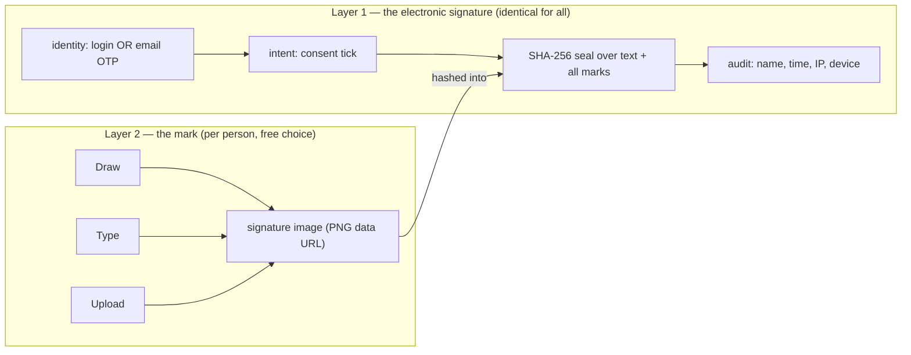

# Design: Sequential Multi-Signature Signing, Draw/Type Signature Capture & Auto-Distribution

Status: **Spec for review — no code written yet** · Branch: `claude/multi-signature-contract-design-0z650b`

Companion to [`DESIGN-contract-sharing.md`](DESIGN-contract-sharing.md). This spec describes how to
add ordered multi-party signing (e.g. **CEO → CFO → COO → counterparty**), per-signer **draw / type /
upload** signature capture, and **automatic distribution of the executed copy to every party** — built to
sit seamlessly on top of what HaTi already has, not beside it.

---

## 1. Goal

A contract can require several signatures in a **fixed order** before it is finished. Each signer must be a
specific person; the platform tracks **who is 1st, 2nd, 3rd**; each signer independently chooses **how** they
sign (draw with a mouse/finger, type a name rendered in a handwriting font, or upload a scan); the
counterparty only ever sees the document **after** all internal signatures are in; and the moment the last
signature lands and the seal is applied, a **sealed copy is emailed to every party** for their own records
while the platform keeps the source of truth.

**Decision locked with the owner:** each signer **chooses their signature form freely** — no workspace-level
mandate. The three forms are always available to everyone; internal-vs-counterparty changes only *how identity
is proven* (HaTi login vs email one-time code), never which form may be used.

---

## 2. What already exists (build on it, don't rebuild it)

HaTi already carries ~50% of this flow as an unfinished scaffold. The design reuses every piece below.

| Capability | Where it lives today |
|---|---|
| **Ordered signer plan** — `c.signerPlan=[{id,party,name,email,order,signed,at}]`, `nextSigner()`, `allSigned()`, editor `openSignerPlanEditor()` | `js/approvals.js:95–131` |
| **Multi-signer sign branch** — internal signer records & advances; seal only on the last | `js/views/contract.js:1019–1030` |
| **Signing status panel** (numbered chips, per-signer state) | `approvalPanelHtml()` / `wireApprovalPanel()`, `js/approvals.js:134–172` |
| **Freeze + SHA-256 seal + verify** | `freezeContractHtml()`, `sealString()`, `verifySeal()`, `js/core.js:680–717` |
| **Signature records array** `c.signatures[]` (`party,name,email,method,ip,ua,at,docHash`) | `js/views/contract.js:1025,1040`; counterparty push `js/core.js:955` |
| **Executed signature block** rendering | `signatureBlock()`, `js/views/contract.js:576` |
| **Evidence pack** export | `downloadEvidence()`, `js/core.js:723` |
| **Counterparty portal sign + email OTP** | `portalRespond()/portalStartOtp()/portalVerifyAndSign()`, `js/views/portal.js:107–190` |
| **Response ingestion + poller** | `applyResponse()` `js/core.js:947`; `pollPendingResponses()` `js/core.js:986` |
| **Server-stamped IP/time** | `POST /api/sign-meta`, `server.js:1300` |
| **Email delivery (Resend + dev outbox fallback)** | `sendEmail()`, `server.js:381`; `outbox` table `server.js:58` |
| **Per-user prefs column** (notification opt-ins) | `users.prefs`, `server.js:201` |
| **File storage** (used for uploaded contract bytes) | `files` table, `server.js:56` |
| **Contracts stored as a JSON blob** + denormalized index columns | `contracts` table `server.js:66`; write path `saveContract` `server.js:125` |

### 2.1 The single most important architectural fact

A contract is persisted as **one JSON document** in `contracts.json`, with a handful of columns
(`name,counterparty,folder,status,value,expiry,is_upload,seq,version,updated_at`) denormalized purely for
indexing (`server.js:125–126`). Therefore **every new field in this spec — extended signer plan, signature
images, the distribution log — lives inside that existing blob and needs no contract-table migration.** The
only additive storage is on `users.prefs` (already a column) for the optional saved signature.

---

## 3. The two layers (why free-choice is safe)

Keep two concerns strictly separate; the whole design falls out of this.



- **Layer 1** is what carries legal weight (Business Laws (Amendment) Act 2020) and is **the same for every
  signer** regardless of form. It already exists.
- **Layer 2** is the visible mark and is **chosen per signer**. It is new. It is *evidence of intent*, not the
  legal mechanism — which is exactly why "type your name" is as valid as hand-drawing.
- The two meet at the seal: the chosen mark's hash is folded **into** the SHA-256 seal, so the squiggle is as
  tamper-evident as the text it sits on.

---

## 4. Data model changes (all additive, all inside the contract JSON)

No `ALTER TABLE` on `contracts`. Fields shown as plain shapes for review.

### 4.1 Signer plan → **Signing Route** (extend `c.signerPlan[]`)

```
signer = {
  id, order,
  party:        'internal' | 'counterparty',
  name, email,
  memberId:     <HaTi user id>   // NEW — internal signers bind to a real member (identity enforcement)
  role:         'CEO' | 'CFO' | ... // NEW — free-text title shown in the tracker
  signed:       false,
  at:           null,            // set when signed
  by:           null,            // who actually signed (audit)
  signature:    null             // NEW — the captured mark, see 4.2
}

c.signerRoute = {                // NEW wrapper (back-compat: absent ⇒ behave as today)
  gateAfterOrder: <n> | null,    // internal→counterparty gate: counterparty link dormant until order ≤ n all signed
  signers: [ signer, ... ]
}
```
Back-compat: existing `c.signerPlan` (flat array) is read if `c.signerRoute` is absent; a one-time in-memory
upcast wraps it. Contracts with neither remain single-signer, unchanged.

### 4.2 Signature record (extend the objects pushed to `c.signatures[]`)

```
signature = {
  party, name, title, email, role, at, ip, ua, docHash,   // ALL existing
  form:      'draw' | 'type' | 'upload',   // NEW — how they signed (free choice)
  image:     '<PNG data URL>',             // NEW — the mark, capped ≤ 600×200, compressed
  imageHash: '<sha256 of image>',          // NEW — folded into the seal (see §6.7)
  typedName: '<string>' | null,            // NEW — for 'type', the text entered
  font:      '<style id>'  | null,         // NEW — for 'type', the chosen handwriting style
  method:    'session-authenticated' | 'email-otp'  // existing, now precise
}
```

### 4.3 Distribution log (new object on the contract)

```
c.distribution = {
  at, triggeredBy: 'auto',
  cc: [ '<records mailbox>' ],
  recipients: [ { name, email, role, party, status:'sent'|'delivered'|'bounced', at, via:'resend'|'outbox', fileId } ]
}
```

### 4.4 Saved signature (per user — the one place we touch `users.prefs`)

```
users.prefs.savedSignature = { form, image, typedName, font }   // optional adopt-and-reuse
```

---

## 5. End-to-end flow

```mermaid
sequenceDiagram
  participant O as Owner
  participant P as Signer N (internal)
  participant S as Server
  participant CP as Counterparty
  O->>O: Build Signing Route (signers, order, gate)
  loop each internal signer in order
    S-->>P: "It's your turn" email (login link)
    P->>P: opens contract, Sign → Signature Pad (draw/type/upload, free choice)
    P->>S: save signature on c.signatures[] + advance nextSigner
  end
  Note over S: last internal signer done → gate opens
  S->>CP: auto-create share + email link (existing POST /api/shares)
  CP->>S: opens portal → Signature Pad → email OTP → respond{sign, image, form}
  S-->>O: poller applyResponse() records counterparty signature
  Note over O,S: allSigned ⇒ finalizeExecution(): freeze + seal (over text + all marks)
  S->>O,P,CP: POST /api/contracts/:id/distribute → sealed copy to every party
```

---

## 6. Component specifications

### 6.1 Signing Route builder — *upgrade* `openSignerPlanEditor()` (`js/approvals.js:101`)

- Add per-row **member picker** for internal signers (populates `memberId`, `name`, `email`, `role` from the
  team list) and a free-text **role/title** field.
- Add a **gate toggle** on a row: "counterparty link opens after this signer" → sets `gateAfterOrder`.
- Keep drag-reorder; re-number `order` on save (as today).
- Surface it properly: the current faint *"Set a multi-signer order…"* link (`contract.js:991`) becomes a
  first-class **"Signing route"** action in the sign panel.
- **Route templates** (later phase): a Save-as-template button writes to `settings.signingRoutes[]`; the
  existing approval-rules engine (`approvalRules()`, `approvals.js:10`) can auto-attach one by value/type.

### 6.2 Signing tracker — *upgrade* `approvalPanelHtml()` (`js/approvals.js:134`)

- Render the route as the vertical timeline from the proposal (Design ②): **done** (green ✓ + timestamp +
  form + IP), **current** (amber ring — exactly one holder), **waiting** (grey).
- Reuse the existing per-signer state already computed by `nextSigner()`/`allSigned()`.
- Three sizes, one source: full timeline in the workspace; a `2 of 4 signed` pill in the register
  (`js/views/register.js`); a "waiting on you to sign" roll-up on home (`js/views/home.js`).

### 6.3 Signature Pad — **new module `js/signature.js`**

A single reusable modal used by both the in-app signer and the counterparty portal:
`openSignaturePad({ name, saved }) → Promise<{ form, image, imageHash, typedName?, font? } | null>`.

- **Draw tab** — a `<canvas>` with Pointer Events (mouse/touch/stylus), "clear", trims transparent margins,
  exports a downscaled PNG data URL.
- **Type tab** — an input; the name renders live in a handwriting style; a small style picker (3–4 fonts).
  Render to canvas → PNG so the stored artifact is an image, not font-dependent text. Fonts embedded as
  `@font-face` data-URIs to avoid the CSP/CDN issue noted in the repo.
- **Upload tab** — file input → image → downscale to ≤ 600×200 → PNG data URL.
- **Free choice**: no tab is hidden or disabled for anyone; the counterparty portal shows the identical pad.
- **Adopt & reuse**: an "Adopt & save my signature" checkbox writes `users.prefs.savedSignature`; on the next
  contract the pad pre-loads it (still changeable).
- `imageHash = sha256(image)` computed here (reuse `sha256()` from core).
- **Size discipline**: cap dimensions + PNG compression keep each mark ~5–30 KB; 4 signers ≈ ~100 KB added to
  the contract JSON — acceptable for the blob model; noted in §9.

### 6.4 Signing execution & finalization — *refactor* `signDocument()` (`js/views/contract.js:1000`)

Split the current monolithic sign into **capture** and **finalize** so completion no longer depends on "an
internal user clicking Sign last" (today's seal only fires from `signDocument`, which breaks when the
counterparty is the last signer).

1. **Capture (per signer).** Before recording a signature, call `openSignaturePad()`. On adopt, attach
   `{form,image,imageHash,typedName,font}` to the pushed `c.signatures[]` entry (both the internal-planned
   branch at `contract.js:1025` and the first-party branch at `1040`). Mark `signer.signed=true`, advance.
   - **Identity enforcement**: the internal branch must check `currentUser()` matches the assigned
     `signer.memberId` — not merely `canEdit()`. Wrong-person → blocked, with an audit line. (Server-side
     enforcement of *who* signed is a later hardening; noted in §8.)
2. **Finalize — new `finalizeExecution(c)`** (idempotent; guard on `c.status==='Signed' || c.hash`). Performs
   the existing freeze + seal + status flip (`contract.js:1031–1048`) **plus** triggers distribution (§6.8).
   Called from **two** places:
   - `signDocument()` when the last signer is **internal** and `allSigned(c)` becomes true.
   - `applyResponse()` (`core.js:947`) when a **counterparty** signature makes `allSigned(c)` true — runs
     headless in the poller's browser (`pollPendingResponses`, which only runs for editors); `freezeContractHtml`
     builds from `c` via DOM APIs and needs no open view. If no editor is online, finalization defers to the
     next one that opens the app (noted in §9; server-side finalize is the future upgrade).

### 6.5 The internal→counterparty gate + turn notifications

- **Gate**: `nextSigner()` (`approvals.js:99`) already returns the lowest-order unsigned signer. When that
  signer's `party==='counterparty'`, the in-app Sign button stays inactive (already true at
  `contract.js:1023`). Extend: the counterparty **share link is not created** until every signer with
  `order ≤ gateAfterOrder` is signed.
- **Auto-share at the gate**: when the last internal signature lands and the gate opens, auto-invoke the
  existing `POST /api/shares` (`server.js:1391`) for the counterparty signer's email — or, per policy, prompt
  the owner one-click. Reuses the entire sharing/traffic-light system from `DESIGN-contract-sharing.md`.
- **"Your turn" nudge**: when signer N completes and N+1 is internal, email N+1 a login link. Reuse
  `sendEmail()`; gate on a `users.prefs` opt-in (default on), mirroring the first-open-notification pattern
  (`server.js:1488`).

### 6.6 Counterparty signing in the portal (`js/views/portal.js`)

- Insert the **same Signature Pad** into the portal flow: after the counterparty fills name/email and clicks
  **Approve & sign** (`portal.js:71,107`), open the pad *before* the OTP step (`portalStartOtp`).
- Carry the mark through the response object built at `portal.js:181`:
  `response = { …, action:'sign', signatureForm, signatureImage, signatureImageHash }`.
- `applyResponse()` (`core.js:955`) pushes those onto the counterparty `c.signatures[]` entry, then — if this
  makes `allSigned(c)` true — calls `finalizeExecution(c)` (§6.4).
- Identity is unchanged: email OTP remains the counterparty's Layer-1 mechanism (`verify-otp`, `portal.js:179`).

### 6.7 Seal & integrity — *extend* `sealString()` / `verifySeal()` (`js/core.js:699,705`)

- **Fold the marks into the seal.** `sealString(c)` gains an ordered list of signature hashes:
  `sigs: c.signatures.map(s => ({ name:s.name, at:s.at, form:s.form, imageHash:s.imageHash }))`.
  Because `verifySeal()` recomputes `sealString(c)` from stored data and compares to `c.hash`, and the
  `imageHash` values are stored on the records, verification keeps working — now covering the marks too.
- **Verify the images themselves**: extend `verifySeal()` to re-hash each stored `image` and compare to its
  `imageHash` (mirroring how it re-hashes the frozen text at `core.js:711`). Any altered mark → MISMATCH.
- **Backward compatibility (critical).** Add `c.sealVersion`. `sealString()` branches: absent/`1` → the exact
  current string (so **every already-sealed contract still verifies**); `2` → the new string including `sigs`.
  New seals write `sealVersion:2`.
- **Interim-tamper note**: earlier signers' marks are captured before the final seal exists. Each is
  individually `imageHash`-stamped and audit-logged at capture; the final seal binds them all. Full
  per-step signing certificates are a future hardening (§9).

### 6.8 Auto-distribution — **new `POST /api/contracts/:id/distribute`** (`server.js`, `editor`)

Triggered by `finalizeExecution()` (§6.4), once per contract (idempotent guard via `c.distribution`).

- **Recipients** = every entry in `c.signerRoute.signers` (internal + counterparty) with an email, unioned
  with `c.signatures[]` emails, plus optional workspace **CC** (`settings.recordsMailbox`).
- **Phase 3a (ship first) — link + seal in the body.** Reuse `sendEmail(to, subject, body)` (`server.js:381`):
  "✅ Fully executed — {name}", with the SHA-256 seal and a secure link to the platform copy. Immediate, no
  attachment plumbing, Resend/outbox parity intact.
- **Phase 3b — PDF attachment.** Client renders the executed PDF (reuse `exportPDF`, `portal.js`), uploads
  bytes to the existing `files` table, server attaches via Resend; large files fall back to the link. Store
  `fileId` per recipient.
- **Receipts**: write each send result to `c.distribution.recipients[]`; render the receipts panel (Design ④)
  in the workspace with per-recipient **Resend** on bounce.
- **Source of truth** stays the sealed platform record; the emailed copy is explicitly a convenience copy.

### 6.9 Evidence & rendering

- `signatureBlock()` (`contract.js:576`): draw each signature's `image` above its existing evidence line
  (Design ③b).
- `downloadEvidence()` (`core.js:723`): add `form`, `image`, `imageHash` per signature and the
  `c.distribution` log to the exported pack.

---

## 7. Server endpoints (new / changed)

| Endpoint | Auth | Purpose |
|---|---|---|
| `POST /api/contracts/:id/distribute` | editor | Send the executed copy to all parties; record receipts (idempotent). |
| `POST /api/contracts/:id/notify-signer` | editor | Email the next internal signer that it's their turn (or fold into the save path). |
| `POST /api/shares/:token/respond` *(extend)* | public+OTP | Accept `signatureForm`/`signatureImage`/`signatureImageHash` on `action:sign`. |
| `GET/PUT /api/me/prefs` *(reuse `users.prefs`)* | auth | Store/read `savedSignature` for adopt-and-reuse. |
| `POST /api/files` *(reuse)* | editor | Store the generated executed PDF for attachment (Phase 3b). |

No new tables. `c.signerRoute`, extended `c.signatures[]`, and `c.distribution` all persist through the
existing `saveContract` JSON write (`server.js:125`).

---

## 8. Permissions & roles

- Building/editing a route and triggering distribution require **editor** (admin/legal) — same gate as sharing
  today.
- **Signing as a specific person**: the in-app internal branch enforces `currentUser().id === signer.memberId`
  client-side + audit. Honest limitation: the server currently authorizes *any* editor to write a contract;
  true server-side "only the assigned member may record signer N" is a **Phase-2 hardening** and is disclosed
  in-product (consistent with HaTi's existing honesty about IPRS/PKI).
- Viewers: can see the tracker and receipts, cannot sign or dispatch.

---

## 9. Security, integrity & limits

- **Tamper-evidence** extends to the marks via `sealVersion:2` (§6.7); all existing seals unaffected.
- **Identity** unchanged and honestly disclosed: login for internal, email OTP for counterparty; IPRS/CAK-PKI
  remain roadmap.
- **No document content in email bodies** beyond the agreed executed-copy attachment/link — consistent with
  `DESIGN-contract-sharing.md §9`.
- **Storage size**: signature PNGs live in the contract JSON (~5–30 KB each). Capped dimensions + compression
  keep a 4-signer contract to ~100 KB extra. The per-contract-row storage model (README "Scales to large
  portfolios") absorbs this; flagged for monitoring.
- **PII**: signer emails/marks are personal data — already covered by the audit trail and any export/delete
  path; add `route-created`, `signer-signed`, `execution-finalized`, `copies-distributed` audit events.
- **Deferred finalization**: if the counterparty signs last while no editor is online, the seal + distribution
  run when an editor next opens the app. Acceptable for MVP; server-side finalization is the durable fix.
- **Abuse/limits**: reuse existing `rlShare`/`rlOtp`; add a per-contract distribution idempotency guard and a
  per-user daily distribution cap to protect Resend reputation.

---

## 10. Static mode (no server) parity

- Route, marks, seal and evidence all work offline (they're client-side + localStorage, `persist()`
  `core.js:242`).
- Distribution degrades to **`mailto:` links** pre-addressed to each party with the seal in the body (the
  browser can't send server email), matching the existing static-mode share fallback.
- Counterparty signing keeps the paste-back response-code flow; the mark travels inside the response payload.

---

## 11. Phased delivery

| Phase | Scope | Notes |
|---|---|---|
| **1 — Route + tracker** | Upgrade `openSignerPlanEditor` (member binding, roles, gate) and `approvalPanelHtml` (tracker); per-turn notifications; auto-share at the gate. | Mostly *finishing* the existing scaffold — lowest risk. |
| **2 — Signature Pad** | New `js/signature.js` (draw/type/upload, free choice, adopt & reuse); wire into `signDocument` capture + the portal; render marks; `sealVersion:2` + `verifySeal` extension. | Net-new UI, self-contained; the headline visible upgrade. |
| **3 — Auto-distribution** | `finalizeExecution()` refactor + decoupled finalize; `POST /api/contracts/:id/distribute`; 3a link-in-body, then 3b PDF attachment; receipts panel + resend. | Reuses PDF export + `sendEmail`. |
| **Later** | Route templates + rule-driven auto-attach; server-side signer-identity enforcement; server-side finalization; per-step signing certificates. | Convenience + hardening. |

---

## 12. Open questions / decisions

1. **Out-of-turn signing** — strict order absolute, or admin override (logged)? Design supports either as a
   policy toggle; recommend strict by default.
2. **Auto-share at the gate** — fully automatic to the counterparty, or one-click owner confirm? Recommend
   one-click confirm first (owner keeps control of the outbound moment).
3. **Records CC mailbox** — workspace-wide default (`settings.recordsMailbox`), per-contract, or both?
4. **Distribution copy** — attach the PDF from day one (Phase 3b) or ship link-only (3a) first? Recommend 3a
   first for speed, 3b as a fast follow.
5. **Parallel signers** — needed now (e.g. CFO + COO in any order, then CEO), or strictly sequential for v1?
   The `order` field supports shared numbers; defer the UI unless required.
